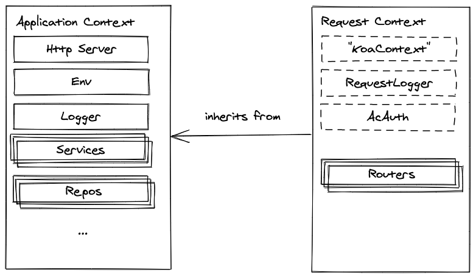

# Application Container

ubio Microservices Framework uses [Inversion of Control](https://en.wikipedia.org/wiki/Inversion_of_control) (IoC) to organize operational modules (i.e. modules which _do_ stuff as opposed to entities which mostly carry and present data around such modules).

IoC allows us to achieve loose coupling which helps with keeping modules more focused and simplifies some aspects of unit testing.

To achieve IoC we use [Dependency Injection](https://en.wikipedia.org/wiki/Dependency_injection) library called [Inversify](https://github.com/inversify/InversifyJS) along with some additional guidelines. It is strongly encouraged to get familiar with the essentials of IoC/DI before moving on.

## Modules, Interfaces, Service Identifiers

In Inversify components refer to each other via so-called "service identifiers":

```ts
import { Logger } from '@ubio/framework';

@injectable()
export class MyService {

    constructor(
        @inject(Logger)
        protected logger: Logger
    ) {}

    myMethod() {
        this.logger.info('Hello');
    }
}
```

In this example `MyService` declares `logger` as its dependency. `@inject(Logger)` decorator specifies that this dependency must be resolved by *service identifier* `Logger` (which happens to be an `abstract class`). Inversify also supports String and Symbol service identifiers, but we prefer using constructors.

> Think of service identifiers as "keys" of imaginary Map, which associates it with an implementation.

Again, `Logger` here acts both as a service identifier and an "interface" which declares logging methods like `.info(...)`. The actual implementation of such methods is unknown to `MyService`, which makes these two components loosely coupled.

> Note: TypeScript `interface` cannot be used as a service identifier, because it is erased by the compiler and thus is not available in runtime. Instead, we use `abstract class` both as a "module interface" (which describes its contract) and as a service identifier to bind implementations.

## Composition Root

The service identifiers are wired with implementations in a single place called _composition root_. By convention each application should have their composition root defined in `src/main/app.ts`:

```ts
import { Application } from './framework';

export class App extends Application {
    constructor() {
        // Bind Logger service identifier to MyLogger class
        this.container.bind(Logger).to(MyLogger);
        // Bind MyService service identifier to the same MyService class
        this.container.bind(MyService).toSelf();
    }
}
```

When the wiring is done, you can request an instance of any service from application container:

```ts
const app = new App();
const myService = app.container.get<MyService>(MyService);
// myService instance is created by Application, and all its dependencies are satisfied
myService.myMethod();
// will call MyLogger#info with "hello" argument
```

Important note: most of the times you do not need to call `app.container.get` directly.
The reason for that is: entry point for http-server microservices code will be routers, which
are already instantiated by application container. Accessing `app.container` directly from injectable modules is discouraged and widely considered an anti-pattern.

## Module Scopes

Most application modules will have _transient_ scope. This means that container will instantiate modules like `MyService` every time they are injected, and will not try to reuse them.

The reason for this default arrangement is to discourage modules from having shared state and relying on it. A notable exception is `logger` which is bound to request scope and therefore will include context data like `requestId` from whatever module calls it.

For some modules that maintain application-wide state (e.g. database connections) this arrangement is not suitable, so these modules must be bound using `inSingletonScope`:

```ts
app.container.bind(MongoDb).toSelf().inSingletonScope();
```

Signletons (for obvious reasons) cannot inject the request scoped modules. As such, the use of singletons should be reduced to minimum, with valid known-so-far use cases being database connectivity modules.

> Note: if you desperately need to share state across modules, there's a couple of approaches to consider before trying to "convince" the container to reuse the same instance. Please escalate the issue to team leads, and we will figure out the proper solution together.

## Request Scope

When application is processing HTTP requests, a number of request-scoped components can be bound to Router classes.

Such components include:

- `AcAuth` (Automation Cloud identity and authorisation data)
- `KoaContext` (bound by string `"KoaContext"` service identifier) — [Koa](https://koajs.org) context object
- `RequestLogger` (re-bound to `Logger`) which includes request-specific data

Internally request scope is achieved by creating a child container inside Koa middleware and subsequently binding request-only components to it. The request-scoped container is also available in `ctx.container` for further manipulations.



## FAQ

Q: How do I make request-bound logger in a singleton (e.g. a database driver)?

A: You can't, because those two modules have incompatible lifecycle (in other words, modules shouldn't live longer than their dependencies). So singletons should only receive application-scoped logger which doesn't include request details.

Instead, consider creating a Repository module which will have shorter life span (thus compatible to request logger) and can still depend on a singleton database driver.
